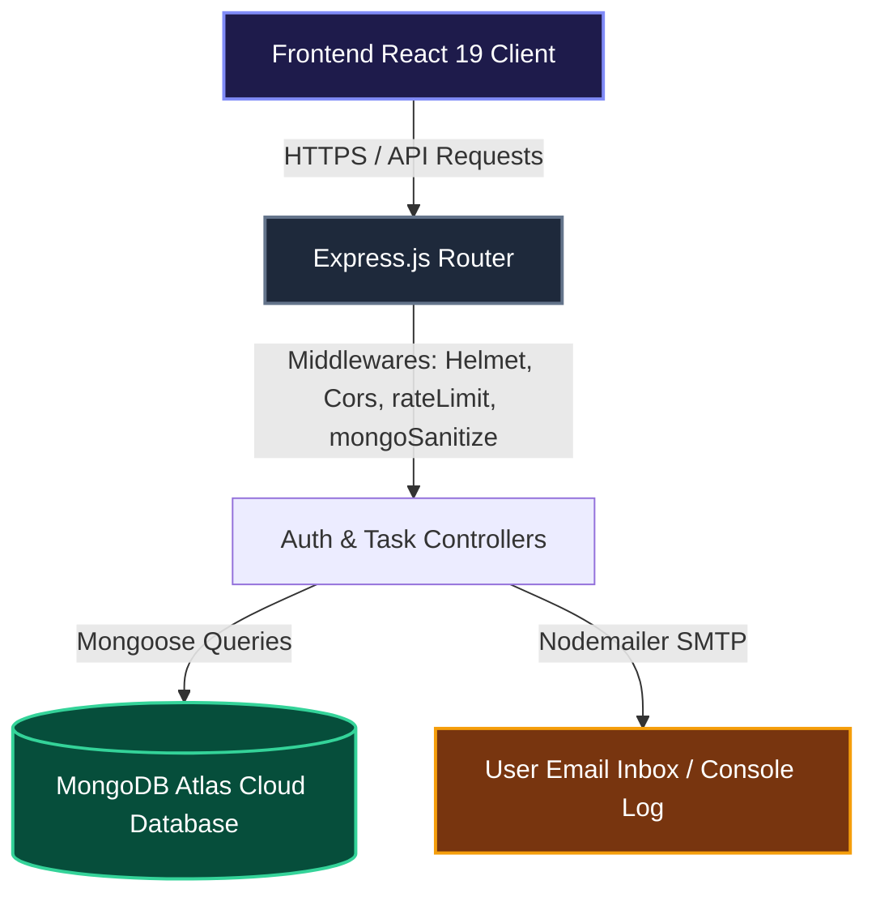

# 🌌 Slate TaskFlow — Premium MERN Task Management App

TaskFlow is a production-grade, security-hardened, and keyboard-optimized task management suite. Crafted with a dark **Obsidian Slate** aesthetic and a warm paper **Moleskine Light** theme, it brings premium craftsmanship to task organization.

---

## 🚀 Live Deployments

- **Live Client Application**: [https://slate-taskflow.vercel.app](https://slate-taskflow.vercel.app)
- **Production API Server**: [https://server-chi-eosin-57.vercel.app](https://server-chi-eosin-57.vercel.app)


---

## ✨ Features & Architecture Highlights

### 🎨 Craftsmanship & Aesthetics
* **Dynamic Obsidian/Moleskine UI**: Double-themed interface supporting deep ink obsidian dark mode and a warm organic paper moleskine light mode.
* **Micro-interactions**: Entrance animations, card expansions, input error shaking effects, and interactive canvas-confetti bursts on task completion.
* **Responsive Layouts**: Designed to be fully responsive for all form factors (Mobile, Tablet, Desktop).

### 🔒 Enterprise-Grade Security
* **Double OTP Identity Verification**: Signups are guarded by a 6-digit secure identity verification system (uses Nodemailer SMTP with safe local fallback console logs).
* **SHA-256 Hashed OTP Store**: OTPs are cryptographically hashed using SHA-256 before writing to the database.
* **Brute-Force Attack Protection**: Rate limiters block clients after 10 failed auth attempts within 15 minutes. Verification attempts are locked after 5 incorrect inputs.
* **Query Injection Block**: Under the hood, `express-mongo-sanitize` intercepts and scrubs queries to completely eliminate NoSQL injection risks.
* **Helmet Security Headers & Payload Caps**: Helmet middleware sets secure HTTP headers, and server payloads are capped strictly at `10kb` to protect against buffer overrun and DDoS attempts.

### ⚡ Power-User Keyboard Optimization
* **Press `N`**: Dynamically expands/collapses the Task Creator form.
* **Press `/`**: Automatically focuses the global search bar.
* **Press `ESC`**: Dismisses overlays, confirmation boxes, and modals instantly.

---

## 🛠️ Technology Stack

* **Frontend**: React 19, Vite, Tailwind CSS, Lucide icons, Canvas Confetti, Axios.
* **Backend**: Node.js, Express.js.
* **Database**: MongoDB & Mongoose.
* **SMTP Transport**: Nodemailer.

---

## 📐 System Architecture



---

## 🔑 Environment Configuration

To deploy and run this project, configure the following environment variables:

### Backend Server (`server/.env`)
| Variable | Purpose | Default / Recommended |
| :--- | :--- | :--- |
| `PORT` | Local running port | `5050` |
| `NODE_ENV` | Running Environment | `development` or `production` |
| `CLIENT_URL` | Allowed CORS Domain | `http://localhost:5173` |
| `MONGODB_URI` | Database Connection URL | MongoDB Atlas Cluster URI |
| `JWT_SECRET` | Secret token encryption | Strong cryptographic 32-character string |
| `JWT_EXPIRES_IN` | Token Validity period | `7d` |

### Frontend Client (`client/.env`)
| Variable | Purpose | Value |
| :--- | :--- | :--- |
| `VITE_API_URL` | Base path API prefix proxy | `/api` |

---

## 🏃 Getting Started (Local Development)

### Prerequisites
- **Node.js** v18 or higher
- **MongoDB** community server (or a cloud MongoDB Atlas account)

### Step-by-Step Installation

1. **Clone and open the directory**:
   ```bash
   git clone https://github.com/PiyushTiwari2051/Slate1.git
   cd Slate1
   ```

2. **Configure and Run the Backend Server**:
   ```bash
   cd server
   npm install
   ```
   Create a `.env` file in the `server` directory and paste:
   ```env
   PORT=5050
   NODE_ENV=development
   CLIENT_URL=http://localhost:5173
   MONGODB_URI=mongodb://localhost:27017/taskflow
   JWT_SECRET=super_strong_session_encryption_secret_key_minimum_32_characters
   JWT_EXPIRES_IN=7d
   ```
   Start the development server:
   ```bash
   npm run dev
   ```
   *(Note: In local development, Nodemailer defaults to console fallback mode. The OTP verification code will print directly in your command line for instant signup verification).*

3. **Configure and Run the Frontend Client**:
   ```bash
   cd ../client
   npm install
   ```
   Create a `.env` file in the `client` directory and paste:
   ```env
   VITE_API_URL=/api
   ```
   Start the Vite client:
   ```bash
   npm run dev
   ```
   Open `http://localhost:5173` to test.

---

## 🔒 Security Best Practices

> [!CAUTION]
> **Never commit your `.env` files to git.** 
> The project's root `.gitignore` is configured to ignore all `.env` files, `.env.*` patterns, and `.vercel/` build folders. Ensure these entries are maintained to prevent accidental credential leakage to public repositories.
